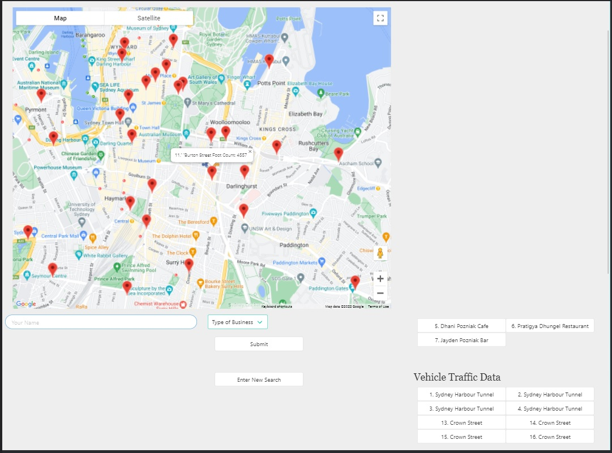

# eunio-awareApp

Summary

The amount of mental health applications (MHapps) available on mobile devices has significantly increased over the years. These technology-based apps have the potential to have a crucial impact for mental health care. Current MHapps do not implement features that are optimized or improve their functionality. Developers have been reluctant in conducting or publishing trial-based experimental validation of their apps. Mobile devices are not restricted by location and usually are owned and operated by a single individual. This privacy aspect when a user engages an application allows the app to become flexible and appealing to users. Users with a high demand for autonomy are an ideal target market for utilising an MHapp. Young adults are very impatient and expect information and data to be accessed almost immediately, and technology has enabled this expectation. Being very familiar with mobile devices allows users to be comfortable with utilising self-help support materials. Apps are always accessible in any context and environment. MHapps are beneficial in being able to send reminders of ongoing goals and provide rewards which can motivate users in achieving their goals.

People who are seeking help in a market filled with clinical diagnosis apps can be harmful to them because they will feel labelled from an app that is assuming that they have a clinical disorder even though they might only be experiencing low-level effects. Reducing stigma and acknowledging the continuum of mental health along with the benefits of well-being promotion can increase the likelihood of a user seeking help. MHapps that take on nonclinical cognitive behavioural therapy (CBT) will be able to reduce the harmful effects of labelling. CBT can be used as a tool to support individuals in coping with nonclinical psychological distress which can reduce the chance of these symptoms reaching clinical urgency. This preventative strategy can assist in preventing relapse, increase a user’s coping skill-set, and avoid developing a clinical disorder. Developers should be familiar with CBT and how they can implement features to create a CBT-based MHapp. This type of application can be used by clinical and nonclinical populations.

When opening the web application, the user will be presented with the landing page displaying a short gif video demonstrating how the application is utilized. The user is required to register an account to access the application. Once the user is logged in, they are directed to their profile page. Features considered for the application are a google maps page where the user can find other users of the application in their surrounding area for meet-ups or communication, an information page providing information on possible health issues related to symptoms the user may be experiencing, and an events page where the user can view upcoming social events that they may be interested in. The user can add as many events to a favourites page as they want and will stay logged in until they choose to logout.

The application uses a server to retrieve and send data across various files which are then used the process the data in order to display information back to the user.The package allowed requested data to be rendered into the body of the html page instead of creating strings and pushing them into an html file.

The following npm's and methods where used in the development of this application:
•	ajax
•	axios
•	jquery
•	mysql
•	express
•	path
•	Procfile
•	mongoose
•	morgan
•	dotenv
•	fs
•	require
•	bycryptjs
•	jsonwebtoken
•	passport
•	validator

Getting Started

This documentation will assist you in viewing this project. To view the project either open
the url of the deployed application with the following address in any browser:

https://shielded-refuge-64890.herokuapp.com/

Download and clone the repository from GitHub using the following command:

git clone https://github.com/rebelbarca/eunio-awareApp.git

This application was built using:
The following coding languages should be considered to build the application:
•	HTML: HyperText Markup Language that allows the developer to describe pages
•	CSS: Style Sheet Language that allows the developer to style an HTML document
•	Bootstrap: Library of HTML and CSS files and code https://getbootstrap.com/
•	API: Application Programming Interface, which is a software intermediary that allows two applications to talk to each other.
•	Node.js: An open-source, cross-platform, JavaScript runtime environment that executes JavaScript code outside of a browser.
•	Express.js: An open-source web application framework for Node.js
•	Heroku: Is a platform as a service (PaaS) that enables developers to build, run, and operate applications in the cloud
•	mySQL: A relational database that organises data into one or more data tables in which data types may be related to each other. These relations help structure the data.
•	mongoDB: Is a cross-platform document-oriented database program. It uses JSON-like documents with schema.
•	React.js: User Interface (UI) components are used as an efficient way to render webpages. Combining this UI with the speed of JavaScript enables dynamic and responsive user inputs.
•	Google Maps: a web mapping platform and consumer application offered by Google. It offers satellite imagery, aerial photography, and street maps.

